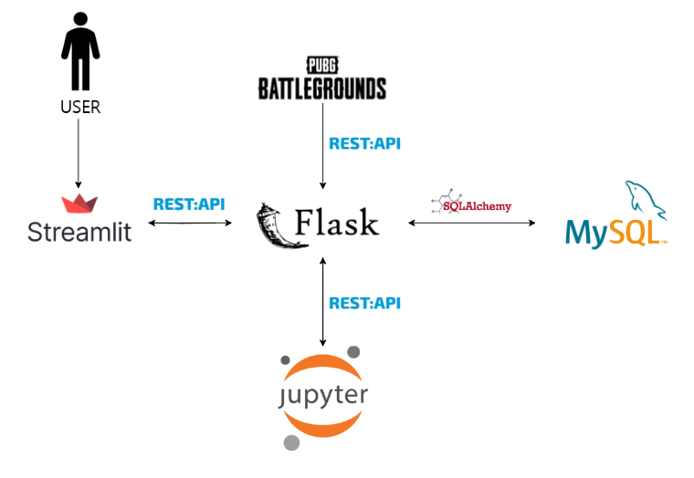

# 🙌 Hello World!
## 👉 소개..
- 본 Repository는 플레이데이터 데이터 엔지니어링 트랙 30기 4번째 단위 프로젝트 3조의 결과물 입니다.
- 24년 6월 18일 ~ 25일 동안 진행되었습니다.
## 👉 주제..
### ❗ 게임 '배틀그라운드'의 안전 지대 선정이 '플레이어들의 위치'에게서 영향을 받는지 '통계분석' 으로 알아보기</u>
- 경쟁전 'Miramar' 맵에서 '흰 원의 중심'이 생성될 때, '모든 플레이어들의 기하학적 중심'에 영향을 받는지 각 Phase별로 알아보았습니다.
- H0 = (각 Phase별로) 경쟁전 Miramar 맵에서의 흰 원의 중심은 모든 플레이어들의 기하학적 중심과 가까울수록 선정될 확률이 높다.
- H1 = (각 Phase별로) 경쟁전 Miramar 맵에서의 흰 원의 중심은 모든 플레이어들의 기하학적 중심과의 거리와 상관없이 선정된다.
### ❗ 간단한 데이터 파이프라인, 백엔드, 프론트엔드 웹서버 구축, 통계분석 및 결과 보고서 작성
- [The PUBG Game Data Service](https://documentation.pubg.com/en/introduction.html)에서 RESTful API, 파일 다운로드 방식으로 제공하는 유저, 게임 데이터 및 로그로부터 데이터를 가져오는 파이프라인 구축
- 적재한 데이터들을 통계 분석에 맞게 정제
- 설정한 가설들에 대해 기초적인 통계 분석 실시 및 분석 결과 보고서 작성
- 간단한 Flask 백엔드 서버, Streamlit 프론트엔드 서버를 구현하여 통계 분석 보고서, 데이터 시각화를 제공하는 웹페이지, 데이터 파이프라인 구성
- 아키텍쳐 설계 및 네트워크 구성, 각 스택간의 협업, 소통 경험
- Github, CLI 방식의 Git Client를 활용한 Git Flow 및 협업 경험
## 👉 주제 선정 이유?
- 평소에 게임을 하면서 궁금하기도 했고, 유저들 간에 의견이 분분하지만 공식적으로는 밝혀지지 않은 사실에 대해 객관적인 데이터를 바탕으로 분석하여 밝혀보기 위해 선정하였습니다.
- 동일한 데이터를 다루는 약 40일 간 진행될 최종프로젝트에 앞서, 최종프로젝트에서 구성한 아키텍쳐에 필요한 기술스택의 기초 및 개념을 익혀보기 위해 공부를 병행하며 Tutorial 느낌으로 선정하였습니다.
- 추후 협업 시 도움이 될 것이라 판단하여, 최종프로젝트에서 짜여진 아키텍쳐를 간소화하고 분배된 역할, 스택의 영역의 일부들을 서로 바꾸어 진행해보기 위해 설정했습니다.
## 👉 분석 결과
### ❗ <u>Analysis/README.md에 작성되어 있습니다!</u>
## 👉 팀원 소개 및 역할 분배
<table>
    <tr>
        <th>김민승 (팀장)</th>
        <th>김경현</th>
        <th>김민성</th>
        <th>이선경</th>
        <th>이진수</th>
    </tr>
    <tr>
        <td>개발 총괄, 감독 개발 환경 구성</td>
        <td>데이터 스키마 분석 파이프라인 구성 데이터 정제 백엔드 서버 프론트엔드 서버</td>
        <td>통계 분석 데이터 정제 분석 결과 보고서 작성</td>
        <td>통계 분석 데이터 정제 분석 결과 보고서 작성</td>
        <td>아키텍쳐 설계 백엔드 서버 프론트엔드 서버</td>
    </tr>
</table>

- 그 외 전체적으로 모두가 모든 영역에서 활발히 의견을 제시, 공유하며 진행했음.

## 👉 레포지토리 구성
### ❗ <u>본 Repository의 하위 Directory에 각자 맡은 스택에서의 구현 과정 및 명세가 README로 서술되어 있습니다!</u>
- FlaskBE : 백엔드 Flask 프로젝트
- FlaskBE/modules : 데이터 파이프라인 및 데이터 정제 모듈
- StreamlitFE : 프론트엔드 Streamlit 프로젝트 (진행 중)
- Analysis : 데이터 분석 및 결과

## 👉 아키텍쳐
- 구성도

  
- 개발 환경, 네트워크 구성

  
## 👉 Git Flow
  

## 👉 느낀점, 회고
