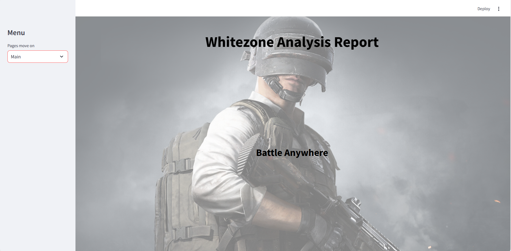
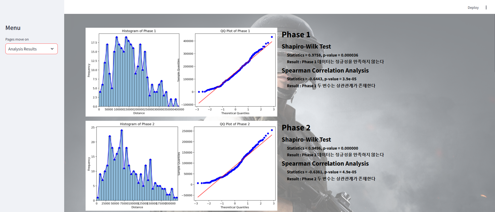

# Streamlit Frontend UI
## 📄 개발 환경 
* Python version : 3.9.10
* OS : Windows 11
* IDE : pycharm
* Packages:
  * streamlit == 1.36.0
  * scipy == 1.13.1
  * requests == 2.32.3
  * pandas == 2.2.2
  * pip == 24.1
  * setuptools == 58.1.0
## 📄 UI Design
### Main page

### Analysis Results page
